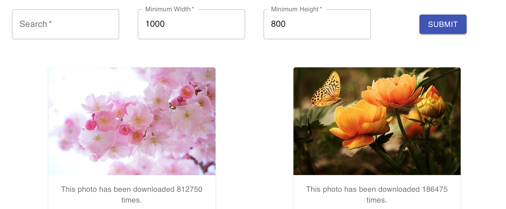
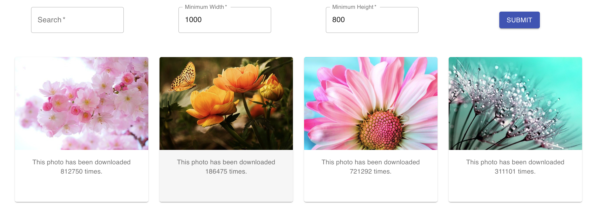
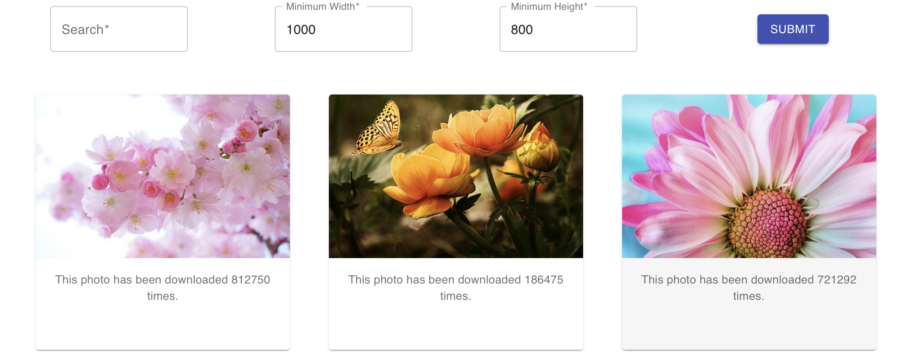
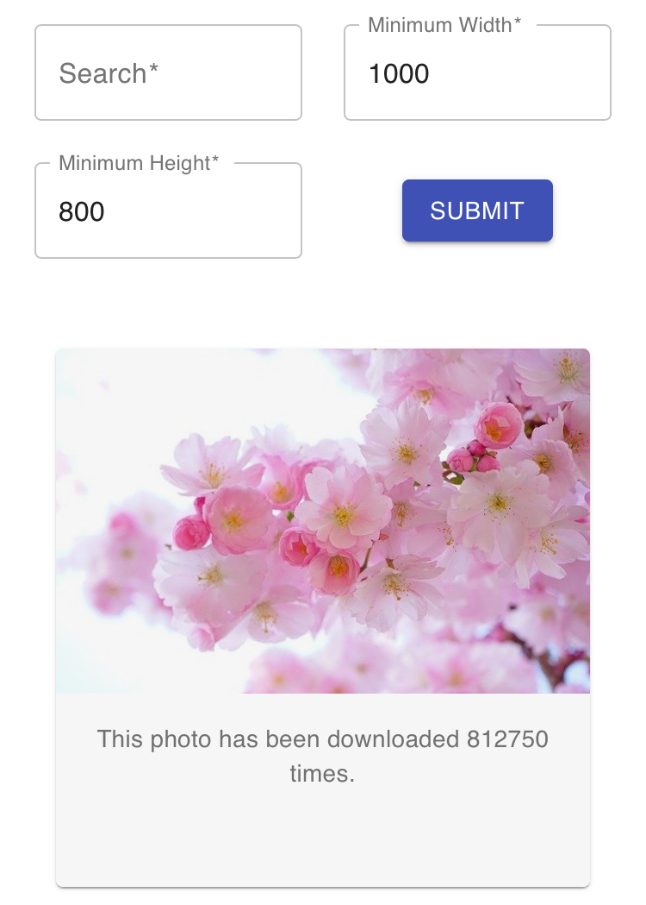

# msa-devops-2020

This is a simple web app to search for photo in a royalty free photo hub called **PixaBay**. This app is deployed on Azure, you could access the app [here](https://msa-2020-devops-joy.azurewebsites.net).

Write in:
* [TypeScript](https://www.typescriptlang.org)
* [React](https://reactjs.org)
* [Material-UI](https://material-ui.com)
* [PixaBay](https://pixabay.com)

## How to use the app
The default of the app is displaying photos matching `flower` as keyword and have minimum 1000px width and 800px height.
User needs to give the following input in order to retrieve the related photos.
* search keyword (required)
* minimum width of the matching images
* minimum height of the matching images
The result will display the matching photos with corresponding downloading times.

## CI and CD using pipelines
Since this app is deployed on Azure, we use Azure DevOps to set up continuous integration(CI) and continuous delivery (CD).

#### Build Pipeline
The build pipeline will be triggered whenever a commit occurred to `master` or `develop` branch in a git repo. The following tasks will be execute in order:
* install [Node.js](https://nodejs.org/en/)
* install [npm](https://www.npmjs.com) and build the app
* archive all the files in `build` folder into a `zip` file
* publish build artifacts to Azure Pipelines

#### Release Pipeline
When an artifacts are published on Azure Pipeline, the Release pipeline can grab the artifacts and deploy the app. I created a filter for `master` branch which means only artifacts built from `master` branch will trigger the Release Pipeline. Adding this filter to make sure that we only release a stable version on the `master` branch to public.

## Responsive design
The app use responsive design.
##### Computer

##### Tablet

##### Phone

